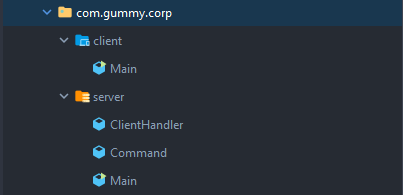

# chat-cli
Command line chatting app with socket implementation using java. 
This chat application using TCP protocol and connect to certain port.
The interface is fully made in command line, give us the "Hacker"
experience 🙂. Give it a try by clone this app or download it as ZIP.
Feel free to open an issue or contribute to this app 👋.

This app containing two folder 
1. Client App
2. Server App

 
You can watch the application demo below.
 

Uploading 2022-02-05 19-26-05.mp4…
